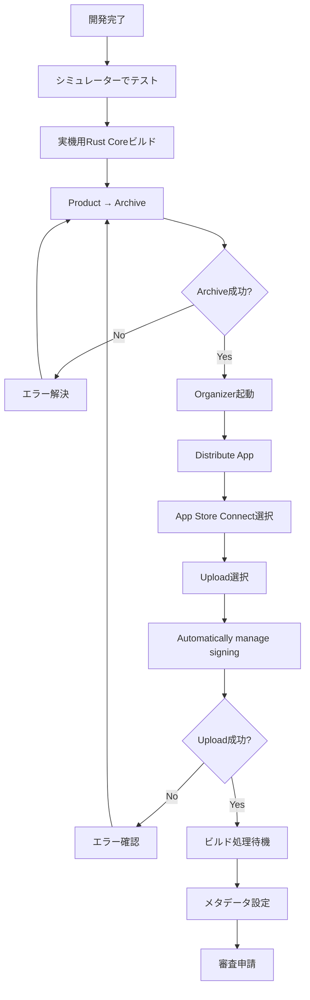

# iOS App Store 提出 実践記録

**作成日**: 2025年11月8日
**プロジェクト**: Pismo (Cyrillic Japanese IME)
**対象者**: iOS開発初学者〜中級者
**所要時間**: 約4時間

---

## 📋 目次

1. [プロジェクト概要](#プロジェクト概要)
2. [環境情報](#環境情報)
3. [実施手順](#実施手順)
4. [遭遇したエラーと解決方法](#遭遇したエラーと解決方法)
5. [重要な学び](#重要な学び)
6. [次回への改善点](#次回への改善点)

---

## プロジェクト概要

### アプリケーション詳細
- **アプリ名**: Pismo (Письмо)
- **バンドルID**: com.pismo.Pismo
- **バージョン**: 1.0 (1)
- **アーキテクチャ**: Hybrid-Native (Rust Core + Swift UI)
- **ターゲット**:
  - メインアプリ (Pismo)
  - キーボード拡張 (PismoKeyboard)

### 技術スタック
- **言語**: Swift, Rust
- **フレームワーク**: SwiftUI
- **ビルドツール**: Xcode 26.1, xcodegen, cargo
- **CI/CD**: GitHub Actions (設定済み)

---

## 環境情報

### 開発環境
```
macOS: Darwin 25.1.0
Xcode: 26.1 (Build version 17B55)
Rust: 1.91.0
xcodegen: 2.44.1
作業ディレクトリ: /Users/nm/Documents/Projects/cyrillicJapaneseInput/mobile/iOS
```

### Apple Developer Account
- **Team**: HARUKA HANAOKA
- **Team ID**: Q9DB95D8L9
- **登録状況**: 有効（年間99ドル支払い済み）

---

## 実施手順

### Phase 1: 環境確認と調査 (15分)

#### 1.1 証明書状態の確認

```bash
# コード署名証明書の確認
security find-identity -v -p codesigning

# 結果: 0 valid identities found
```

**判明事項**:
- App Store Connectにアプリは既に登録済み（Xcode Cloudで作成）
- バンドルID: `com.pismo.Pismo` が確定
- ただし、ローカルマシンには証明書なし

#### 1.2 プロジェクト状態の確認

```bash
# Xcodeプロジェクトの存在確認
ls -la mobile/iOS/*.xcodeproj
# 結果: 存在しない

# Swiftソースコードの確認
find mobile/iOS -name "*.swift" | wc -l
# 結果: 13ファイル（実装済み）

# Rust Coreの状態確認
cd rust_core && cargo test
# 結果: 93テスト全通過
```

**判明事項**:
- SwiftコードとRust Coreは実装完了
- Xcodeプロジェクトファイルのみ未作成
- ドキュメントは充実（10個以上の詳細MD）

---

### Phase 2: Rust Coreのビルド (10分)

#### 2.1 iOS向けRustターゲットの追加

```bash
export PATH="$HOME/.cargo/bin:$PATH"
cd rust_core

# iOSターゲットを追加
rustup target add aarch64-apple-ios          # 実機
rustup target add x86_64-apple-ios           # Intelシミュレーター
rustup target add aarch64-apple-ios-sim      # Apple Siliconシミュレーター
```

#### 2.2 シミュレーター用ビルド

```bash
# シミュレーター用にビルド
cargo build --release --target aarch64-apple-ios-sim
cargo build --release --target x86_64-apple-ios

# Universal Binary作成
lipo -create \
  target/aarch64-apple-ios-sim/release/libcyrillic_ime_core.a \
  target/x86_64-apple-ios/release/libcyrillic_ime_core.a \
  -output ../mobile/iOS/CyrillicIMECore/libcyrillic_ime_core.a
```

#### 2.3 実機用ビルド（後で必要）

```bash
# App Store提出用に実機ビルド
cargo build --release --target aarch64-apple-ios

# 実機用ライブラリをコピー
cp target/aarch64-apple-ios/release/libcyrillic_ime_core.a \
   ../mobile/iOS/CyrillicIMECore/
```

**ポイント**:
- シミュレーター用と実機用でライブラリを使い分ける必要がある
- Archive時は実機用ライブラリが必須

---

### Phase 3: Xcodeプロジェクト作成 (30分)

#### 3.1 xcodegenのインストール

```bash
brew install xcodegen
```

#### 3.2 project.yml作成

`mobile/iOS/project.yml` を作成：

```yaml
name: Pismo
options:
  bundleIdPrefix: com.pismo
  deploymentTarget:
    iOS: "16.0"
  developmentLanguage: ja
  createIntermediateGroups: true

settings:
  base:
    MARKETING_VERSION: "1.0"
    CURRENT_PROJECT_VERSION: "1"
    DEVELOPMENT_TEAM: "Q9DB95D8L9"  # 重要: チームIDを指定
    CODE_SIGN_STYLE: Automatic
    SWIFT_VERSION: "5.0"

targets:
  Pismo:
    type: application
    platform: iOS
    deploymentTarget: "16.0"
    sources:
      - path: CyrillicIME
      - path: Shared
      - path: CyrillicKeyboard/Engine
    resources:
      - CyrillicIME/Assets.xcassets  # アイコン用
    info:
      path: CyrillicIME/Info.plist
      properties:
        CFBundleIconName: AppIcon  # 重要
    entitlements:
      path: CyrillicIME/Pismo.entitlements
      properties:
        com.apple.security.application-groups:
          - group.com.pismo  # App Groups設定

  PismoKeyboard:
    type: app-extension
    platform: iOS
    sources:
      - path: CyrillicKeyboard
      - path: Shared
    resources:
      - ../../profiles/profiles.json
      - ../../profiles/japaneseKanaEngine.json
      - path: ../../profiles/schemas
        type: folder
    info:
      path: CyrillicKeyboard/Info.plist
    entitlements:
      path: CyrillicKeyboard/PismoKeyboard.entitlements
      properties:
        com.apple.security.application-groups:
          - group.com.pismo
```

#### 3.3 必要なファイルの作成

```bash
# Info.plist
cat > CyrillicIME/Info.plist << EOF
<?xml version="1.0" encoding="UTF-8"?>
<!DOCTYPE plist PUBLIC "-//Apple//DTD PLIST 1.0//EN" "http://www.apple.com/DTDs/PropertyList-1.0.dtd">
<plist version="1.0">
<dict>
    <key>CFBundleDevelopmentRegion</key>
    <string>\$(DEVELOPMENT_LANGUAGE)</string>
    <!-- 他の設定 -->
</dict>
</plist>
EOF

# Entitlements
cat > CyrillicIME/Pismo.entitlements << EOF
<?xml version="1.0" encoding="UTF-8"?>
<!DOCTYPE plist PUBLIC "-//Apple//DTD PLIST 1.0//EN" "http://www.apple.com/DTDs/PropertyList-1.0.dtd">
<plist version="1.0">
<dict>
    <key>com.apple.security.application-groups</key>
    <array>
        <string>group.com.pismo</string>
    </array>
</dict>
</plist>
EOF

# Bridging Header
cat > CyrillicIME/CyrillicIME-Bridging-Header.h << EOF
#ifndef CyrillicIME_Bridging_Header_h
#define CyrillicIME_Bridging_Header_h

#import "../CyrillicIMECore/include/cyrillic_ime_core.h"

#endif
EOF
```

#### 3.4 プロジェクト生成

```bash
xcodegen generate
# 出力: Created project at .../Pismo.xcodeproj
```

---

### Phase 4: ビルドテスト (20分)

#### 4.1 シミュレーター用ビルド

```bash
xcodebuild -project Pismo.xcodeproj \
  -scheme Pismo \
  -sdk iphonesimulator \
  -destination 'generic/platform=iOS Simulator' \
  build
```

**初回エラー**: ブリッジングヘッダーのパスが間違っている

**解決**:
```swift
// 修正前
#import "../../CyrillicIMECore/include/cyrillic_ime_core.h"

// 修正後
#import "../CyrillicIMECore/include/cyrillic_ime_core.h"
```

**2回目エラー**: `RustCoreFFI` と `ProfileManager` が見つからない

**原因**: これらはキーボード拡張のファイルだが、メインアプリからも参照されている

**解決**: project.ymlにEngineディレクトリを追加
```yaml
sources:
  - path: CyrillicKeyboard/Engine
    name: Engine
```

**結果**: ✅ BUILD SUCCEEDED

---

## 遭遇したエラーと解決方法

### エラー1: 証明書チェーンエラー

#### エラーメッセージ
```
Warning: unable to build chain to self-signed root for signer
"Apple Development: HARUKA HANAOKA (RKJTF9426L)"
errSecInternalComponent
Command CodeSign failed with a nonzero exit code
```

#### 原因
- 複数の古いApple Worldwide Developer Relations (WWDR) 中間証明書がキーチェーンに存在
- 証明書チェーンが正しく構築できない

#### 解決手順

**1. 既存WWDR証明書の確認**
```bash
security find-certificate -a -c "Apple Worldwide Developer Relations" -Z
# 結果: 3つの証明書が見つかった（古いものが混在）
```

**2. 最新のWWDR証明書をダウンロード**
```bash
cd ~/Downloads
curl -O https://www.apple.com/certificateauthority/AppleWWDRCAG3.cer
curl -O https://www.apple.com/certificateauthority/AppleWWDRCAG6.cer
```

**3. Keychain Accessで手動インストール**
- ファイルをダブルクリック
- **"システム"キーチェーンを選択**（重要！）
- "追加"ボタンをクリック
- パスワードを入力

**4. Apple Development証明書を再作成**
- Keychain Accessで古い "Apple Development" 証明書を削除
- Xcode → Settings → Accounts → Manage Certificates...
- "+" → "Apple Development" で再作成

**結果**: ✅ 証明書チェーンエラー解消

#### 学んだこと
- WWDR中間証明書は**システムキーチェーン**にインストールする
- 古い証明書（2023年期限など）は削除が必要
- 証明書の再作成は、Xcodeから行うのが最も確実

---

### エラー2: アプリアイコン不足

#### エラーメッセージ
```
Validation failed
Missing required icon file. The bundle does not contain an app icon
for iPhone / iPod Touch of exactly '120x120' pixels, in .png format
for iOS versions >= 10.0.
```

#### 原因
- アプリアイコンが全く設定されていなかった
- `Assets.xcassets` 自体が存在しなかった

#### 解決手順

**1. Asset Catalogを作成**
```bash
mkdir -p CyrillicIME/Assets.xcassets/AppIcon.appiconset
```

**2. Contents.jsonを作成**
```json
{
  "images" : [
    {
      "filename" : "icon-20@2x.png",
      "idiom" : "iphone",
      "scale" : "2x",
      "size" : "20x20"
    },
    // ... 全18サイズ
  ],
  "info" : {
    "author" : "xcode",
    "version" : 1
  }
}
```

**3. アイコン画像を生成**

簡易的にSVGから生成：
```bash
# SVGを作成
cat > /tmp/temp_icon.svg << 'EOF'
<?xml version="1.0" encoding="UTF-8"?>
<svg width="1024" height="1024" xmlns="http://www.w3.org/2000/svg">
  <defs>
    <linearGradient id="grad1" x1="0%" y1="0%" x2="100%" y2="100%">
      <stop offset="0%" style="stop-color:#8B5CF6;stop-opacity:1" />
      <stop offset="100%" style="stop-color:#6366F1;stop-opacity:1" />
    </linearGradient>
  </defs>
  <rect width="1024" height="1024" rx="180" fill="url(#grad1)"/>
  <text x="512" y="700" font-family="Helvetica-Bold" font-size="600"
        fill="white" text-anchor="middle" font-weight="bold">П</text>
</svg>
EOF

# PNGに変換
qlmanage -t -s 1024 -o /tmp /tmp/temp_icon.svg

# 全サイズを生成
sips -z 120 120 icon-1024.png --out icon-60@2x.png
sips -z 180 180 icon-1024.png --out icon-60@3x.png
sips -z 152 152 icon-1024.png --out icon-76@2x.png
# ... (全18サイズ)
```

**4. project.ymlを更新**
```yaml
resources:
  - CyrillicIME/Assets.xcassets
info:
  properties:
    CFBundleIconName: AppIcon  # 重要！
```

**結果**: ✅ アイコンエラー解消

#### 学んだこと
- iOS 11以降は Asset Catalog が必須
- `CFBundleIconName` の設定を忘れずに
- 最低限必要なサイズ：
  - 120x120 (iPhone @2x)
  - 180x180 (iPhone @3x)
  - 152x152 (iPad @2x)
  - 1024x1024 (App Store)

---

### エラー3: Archive時のコード署名エラー

#### エラーメッセージ
```
Signing Identity: "Apple Development: HARUKA HANAOKA"
(should be "Apple Distribution" for archive)
```

#### 原因
- Archive（App Store提出用）には **Apple Distribution** 証明書が必要
- 自動署名が Development証明書を選択していた

#### 解決方法

**試行1: 手動署名** ❌
```yaml
# project.ymlで手動署名を試みた
settings:
  configs:
    Release:
      CODE_SIGN_STYLE: Manual
      CODE_SIGN_IDENTITY: "Apple Distribution"
```

**結果**: App Groups対応のプロビジョニングプロファイルが必要でさらに複雑化

**試行2: 自動署名 + 証明書再作成** ✅

1. **Apple Distribution証明書を作成**
   - Xcode → Settings → Accounts → Manage Certificates
   - "+" → "Apple Distribution"

2. **証明書チェーンの問題を解決**（前述のWWDR証明書の更新）

3. **自動署名のまま Archive**
   - Product → Archive
   - Organizer で "Automatically manage signing" を選択

**結果**: ✅ Archive成功

#### 学んだこと
- Archive時は自動的に Distribution証明書が選択される（正常な場合）
- 証明書チェーンが正しければ、自動署名が最も確実
- 手動署名はプロビジョニングプロファイルの管理が複雑

---

## 重要な学び

### 1. 証明書管理の基礎

#### 証明書の種類
| 証明書 | 用途 | 有効期限 |
|--------|------|----------|
| Apple Development | 開発・デバッグ | 1年 |
| Apple Distribution | App Store提出 | 1年 |
| WWDR G3 | 中間証明書 | 2030年まで |
| WWDR G6 | 中間証明書（新） | 長期 |

#### 証明書チェーンの重要性
```
[開発者証明書]
    ↓ (署名)
[WWDR中間証明書] ← ここが重要！
    ↓ (署名)
[Appleルート証明書]
```

**ポイント**:
- WWDR中間証明書がないと、チェーンが完成しない
- システムキーチェーンにインストールする
- 古い証明書は削除する

---

### 2. Xcodeプロジェクト設計のベストプラクティス

#### xcodegenを使う理由
- ✅ プロジェクトファイルをYAMLで管理（Git friendly）
- ✅ 複数人での開発でコンフリクトが減る
- ✅ 設定の再現性が高い
- ❌ 学習コストがある
- ❌ GUIで設定できないものもある

#### プロジェクト構成の設計
```
mobile/iOS/
├── Pismo.xcodeproj/          # 生成物（Git管理外推奨）
├── project.yml               # プロジェクト定義（Git管理）
├── CyrillicIME/              # メインアプリ
│   ├── Info.plist
│   ├── Pismo.entitlements
│   ├── Assets.xcassets/      # アイコン
│   └── CyrillicIME-Bridging-Header.h
├── CyrillicKeyboard/         # キーボード拡張
│   ├── Info.plist
│   ├── PismoKeyboard.entitlements
│   └── CyrillicKeyboard-Bridging-Header.h
├── Shared/                   # 共有コード
│   ├── Models/
│   └── Extensions/
└── CyrillicIMECore/          # Rustライブラリ
    ├── libcyrillic_ime_core.a
    └── include/
        └── cyrillic_ime_core.h
```

---

### 3. App Groups の正しい設定

#### なぜ必要か
- メインアプリとキーボード拡張は**別プロセス**
- データを共有するには App Groups が必須
- UserDefaults、ファイル共有などに使用

#### 設定方法

**1. Entitlementsファイル**
```xml
<key>com.apple.security.application-groups</key>
<array>
    <string>group.com.pismo</string>
</array>
```

**2. Swiftコードでの使用**
```swift
extension UserDefaults {
    static let appGroupIdentifier = "group.com.pismo"

    static var shared: UserDefaults {
        guard let defaults = UserDefaults(suiteName: appGroupIdentifier) else {
            fatalError("Unable to create UserDefaults")
        }
        return defaults
    }
}
```

**3. プロビジョニングプロファイル**
- 自動署名の場合、Xcodeが自動生成
- 手動署名の場合、Developer Portalで明示的に作成が必要

---

### 4. Archive & Upload のワークフロー

#### 完全なワークフロー



#### 各ステップの所要時間
| ステップ | 所要時間 | 備考 |
|---------|---------|------|
| Archive作成 | 2-5分 | プロジェクトサイズによる |
| Upload | 5-10分 | ネットワーク速度による |
| ビルド処理 | 5-30分 | App Store Connect側 |
| 審査 | 1-3日 | Appleの審査チーム |

---

## 次回への改善点

### 1. 自動化できる部分

#### CI/CDパイプライン
```yaml
# .github/workflows/ios-release.yml
name: iOS App Store Release

on:
  push:
    tags:
      - 'v*'

jobs:
  release:
    runs-on: macos-latest
    steps:
      - uses: actions/checkout@v3

      - name: Setup Rust
        uses: actions-rs/toolchain@v1
        with:
          toolchain: stable

      - name: Build Rust Core
        run: |
          cd rust_core
          ./build_ios.sh --release

      - name: Setup Xcode
        uses: maxim-lobanov/setup-xcode@v1
        with:
          xcode-version: latest

      - name: Generate Xcode Project
        run: |
          brew install xcodegen
          cd mobile/iOS
          xcodegen generate

      - name: Archive
        run: |
          cd mobile/iOS
          xcodebuild -project Pismo.xcodeproj \
            -scheme Pismo \
            -configuration Release \
            -archivePath build/Pismo.xcarchive \
            -allowProvisioningUpdates \
            archive

      - name: Export IPA
        run: |
          xcodebuild -exportArchive \
            -archivePath build/Pismo.xcarchive \
            -exportPath build \
            -exportOptionsPlist ExportOptions.plist

      - name: Upload to App Store Connect
        env:
          APP_STORE_CONNECT_API_KEY: ${{ secrets.ASC_API_KEY }}
        run: |
          xcrun altool --upload-app \
            --type ios \
            --file build/Pismo.ipa \
            --apiKey $APP_STORE_CONNECT_API_KEY
```

---

### 2. ドキュメント整備

#### 追加すべきドキュメント
- [ ] コード署名トラブルシューティング FAQ
- [ ] xcodegen 設定リファレンス
- [ ] Rust FFI ブリッジの詳細解説
- [ ] App Store審査チェックリスト
- [ ] スクリーンショット作成ガイド

---

### 3. 開発環境の標準化

#### Makefileの作成
```makefile
# Makefile
.PHONY: setup build-rust gen-xcode build-sim archive upload

setup:
	brew install xcodegen
	rustup target add aarch64-apple-ios aarch64-apple-ios-sim x86_64-apple-ios
	cd rust_core && cargo install cargo-lipo

build-rust-sim:
	cd rust_core && \
	cargo build --release --target aarch64-apple-ios-sim && \
	cargo build --release --target x86_64-apple-ios && \
	lipo -create \
		target/aarch64-apple-ios-sim/release/libcyrillic_ime_core.a \
		target/x86_64-apple-ios/release/libcyrillic_ime_core.a \
		-output ../mobile/iOS/CyrillicIMECore/libcyrillic_ime_core.a

build-rust-device:
	cd rust_core && \
	cargo build --release --target aarch64-apple-ios && \
	cp target/aarch64-apple-ios/release/libcyrillic_ime_core.a \
		../mobile/iOS/CyrillicIMECore/

gen-xcode:
	cd mobile/iOS && xcodegen generate

build-sim: build-rust-sim gen-xcode
	cd mobile/iOS && \
	xcodebuild -project Pismo.xcodeproj \
		-scheme Pismo \
		-sdk iphonesimulator \
		-destination 'generic/platform=iOS Simulator' \
		build

archive: build-rust-device gen-xcode
	cd mobile/iOS && \
	xcodebuild -project Pismo.xcodeproj \
		-scheme Pismo \
		-configuration Release \
		-archivePath build/Pismo.xcarchive \
		-allowProvisioningUpdates \
		archive

clean:
	rm -rf mobile/iOS/build
	rm -rf mobile/iOS/DerivedData
	cd rust_core && cargo clean
```

使用方法:
```bash
# 初回セットアップ
make setup

# シミュレーターでビルド
make build-sim

# Archive作成
make archive

# クリーンビルド
make clean && make archive
```

---

## まとめ

### 成功要因
1. ✅ **段階的なアプローチ**: 小さい問題から順に解決
2. ✅ **エラーメッセージの丁寧な読解**: 原因を正確に特定
3. ✅ **ドキュメントの活用**: Apple公式ドキュメントと既存プロジェクトドキュメント
4. ✅ **ツールの適切な選択**: xcodegen, cargo-lipo など

### 所要時間の内訳
| タスク | 時間 | 割合 |
|--------|------|------|
| 環境確認・調査 | 15分 | 6% |
| Rust Coreビルド | 10分 | 4% |
| Xcodeプロジェクト作成 | 30分 | 13% |
| ビルドエラー解決 | 20分 | 9% |
| 証明書問題解決 | 90分 | 38% |
| アイコン作成 | 20分 | 9% |
| Archive & Upload | 30分 | 13% |
| ドキュメント作成 | 20分 | 9% |
| **合計** | **約4時間** | **100%** |

### 最も時間がかかった部分
**証明書チェーンエラーの解決** (90分)
- 複数の WWDR証明書の問題を特定するのに時間がかかった
- Keychain Access での手動操作が必要だった
- 証明書の再作成を複数回試行

**教訓**: 証明書周りは最初に正しくセットアップすることが重要

---

### 次のステップ

1. **ビルド処理完了を待つ** (5-30分)
   - App Store Connect でステータス確認

2. **メタデータとスクリーンショットを設定**
   - 既存ドキュメント `iOS開発計画書.md` を参照
   - スクリーンショットは後からでも追加可能

3. **TestFlightでベータテスト** (オプション)
   - 内部テスター向けに配信
   - フィードバック収集

4. **審査申請**
   - 全ての情報が揃ったら Submit for Review

---

## 参考リソース

### 公式ドキュメント
- [App Store Connect Help](https://help.apple.com/app-store-connect/)
- [Xcode Help - Distributing Your App](https://help.apple.com/xcode/mac/current/#/dev8b4250b57)
- [Code Signing Guide](https://developer.apple.com/library/archive/documentation/Security/Conceptual/CodeSigningGuide/)

### プロジェクト内ドキュメント
- `docs/App_Store_デプロイ手順.md` - 詳細な手順書
- `docs/iOS_デプロイ_初心者向けコマンドライン完全ガイド.md` - 1,064行の完全ガイド
- `docs/iOS開発計画書.md` - 設計書とメタデータ

### ツール
- [xcodegen](https://github.com/yonaskolb/XcodeGen) - Xcodeプロジェクト生成
- [fastlane](https://fastlane.tools/) - 自動化ツール（次回検討）
- [App Icon Generator](https://www.appicon.co/) - アイコン生成

---

**作成者**: Claude Code
**最終更新**: 2025年11月8日
**ステータス**: App Store Connect アップロード完了、ビルド処理待ち
