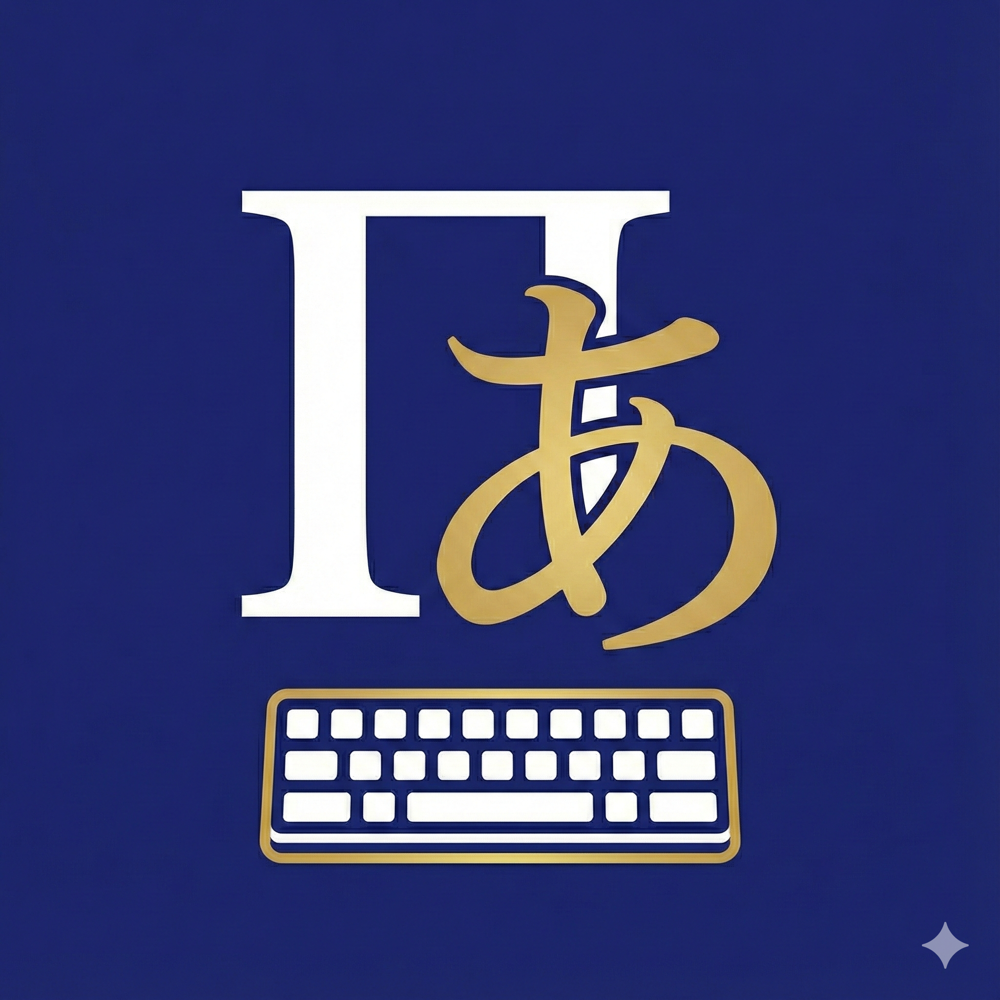
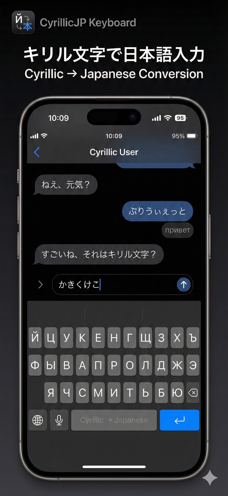
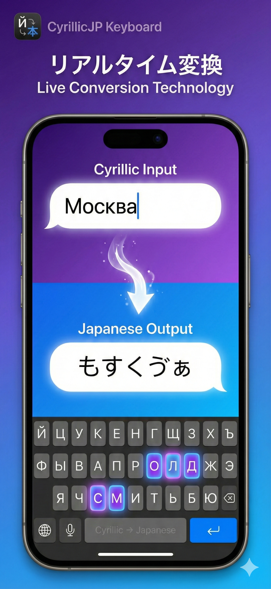
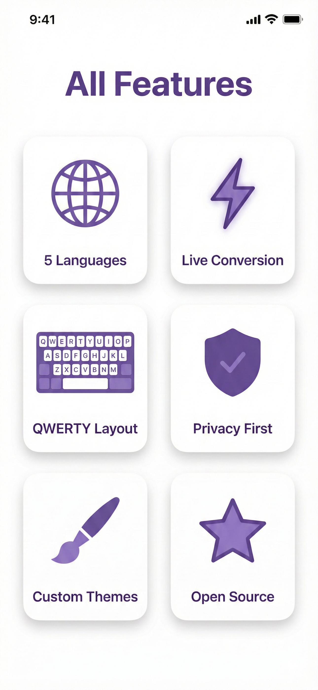

# Pismo — Кирилска японска клавиатура

<p align="center">
  
</p>

<p align="center">
  <strong>Клавиатура за iOS/iPadOS за въвеждане на японски език с кирилица</strong>
</p>

<p align="center">
  <a href="../../README.md">🇯🇵 日本語</a> |
  <a href="README_RU.md">🇷🇺 Русский</a> |
  <a href="README_UK.md">🇺🇦 Українська</a> |
  <a href="README_BE.md">🇧🇾 Беларуская</a> |
  🇧🇬 <strong>Български</strong> |
  <a href="README_SR.md">🇷🇸 Српски</a>
</p>

---

## За приложението Pismo

**Pismo** е клавиатура за iOS/iPadOS, която позволява въвеждането на японски език (хирагана и катакана) с помощта на кирилица.

Името „Pismo" произлиза от славянската дума, означаваща „писмо" или „писменост", символизираща връзката между кирилицата и японския език.

<p align="center">
  
  
</p>

## За кирилицата

Кирилицата е писмена система, развила се в Първото Българско царство през IX век. Тя е създадена на основата на гръцката азбука за предаване на фонетиката на славянските езици.

**България е родината на кирилицата.** През 886 г. учениците на Кирил и Методий пристигат в България, където при царуването на Борис I се създава и развива кирилската писменост.

Днес кирилицата се използва в много езици:

| Език | Регион | Особености |
|------|--------|------------|
| Руски | Русия | 33 букви |
| Украински | Украйна | 33 букви (включително І, Ї, Є, Ґ) |
| Беларуски | Беларус | 32 букви (включително Ў, І) |
| Български | България | 30 букви (родината на кирилицата) |
| Сръбски | Сърбия | 30 букви (използва се и латиница) |
| Други | Монголия, Казахстан и др. | Уникални разширения на азбуката |

**Важно:** Това приложение няма политическа насоченост. То е създадено от чист интерес към кирилицата като писмена система и за подпомагане на изучаването на езици.

## За кого е това приложение

- **За японци, интересуващи се от кирилицата**
  - Изучаващи славянски езици
  - Изучаващи текстове на Източната православна църква
  - Любители на руската и украинската литература
  - Интересуващи се от лингвистика и писменост

- **За потребители на кирилица, изучаващи японски език**
  - За тези, които са свикнали с кирилска клавиатура и искат да въвеждат японски текст

## Основни функции

- **Поддръжка на 5 езика**
  - Руски (Русский)
  - Украински (Українська)
  - Беларуски (Беларуская)
  - Български (Български)
  - Сръбски (Српски)

- **Конвертиране в реално време**
  - Въвеждане с кирилица → моментално преобразуване в японски (хирагана/катакана)
  - Пример: `здравей` → `ずどらゔぇい`

- **Високоточен двигател за конвертиране**
  - Използва двигателя azooKey
  - Включва невронна система за преобразуване кана-канджи „Zenzai"

- **Поверителност**
  - Данните за въвеждане не се изпращат на сървър
  - Работи изцяло офлайн

<p align="center">
  
  
</p>

## Инсталиране

Потърсете „Pismo" в App Store или изтеглете от линка по-долу.

*Линк към App Store: подготвя се за публикуване*

## Разработка

Pismo е проект с отворен код, базиран на [azooKey](https://github.com/azooKey/azooKey).

### Как да компилирате

```bash
# Клонирайте хранилището (с подмодули)
git clone https://github.com/clearclown/cyrillicJapaneseInput --recursive

# Отворете iOS проекта
open iOS/Pismo.xcodeproj
```

## Лиценз

MIT License

Copyright (c) 2024-2025 clearclown

Този проект е базиран на [azooKey](https://github.com/azooKey/azooKey).
azooKey Copyright (c) 2020-2025 Keita Miwa (ensan)

---

<p align="center">
  <strong>Pismo</strong> — мост между кирилицата и японския език
</p>
